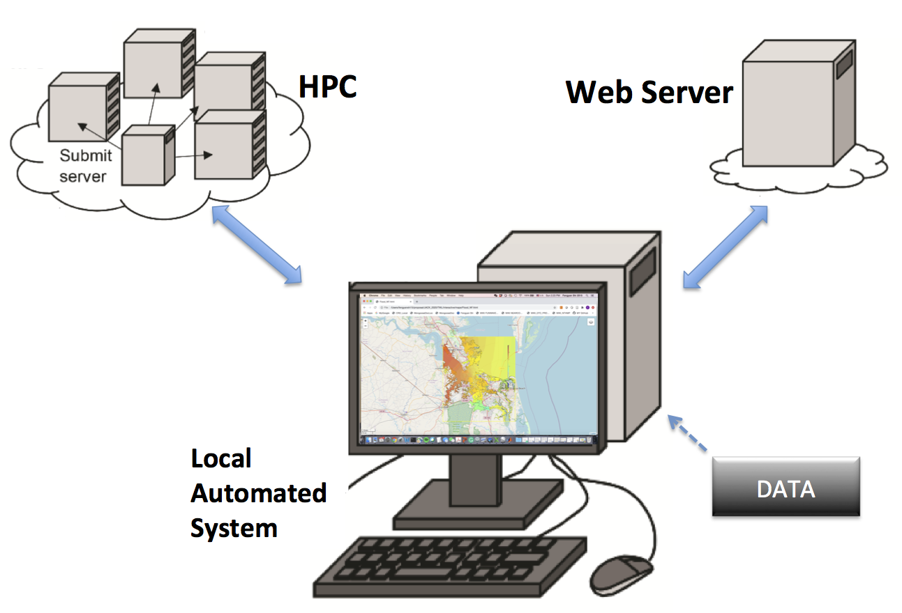

.. CSS documentation master file, created by
   sphinx-quickstart on Fri Jan  1 15:15:56 2021.
   You can adapt this file completely to your liking, but it should at least
   contain the root `toctree` directive.

.. role:: raw-html(raw)
   :format: html

===============================
Description
===============================

Interactive Web Interface
****************************************

The interactive Web Interface (IWI) provides connections between computational components and data input/analysis and visualization. An automated system is used to scrape forcing data from outside sources such as tides, wind, atmospheric pressure, wind waves. It generates boundary and forcing conditions needed by the models. It also handles scheduling, data analysis, data transfer between HPC and Web server.  

Model Coupling System
****************************************

The Model Coupling System (MCS) links models in different scales and physics. The model components include the Coupled Ocean Atmosphere Wave Sediment Transport Modeling System (COAWST), Finite Volume Community Ocean Model (FVCOM), and in-house models, such as NearCoM, FUNWAVE-TVD, and NHWAVE. 

The following WIKI lists the in-house models and typical applications in Delaware Bay and adjacent nearshore regions.  

============
Wiki Content
============
.. toctree::
   :maxdepth: 2
   :caption: Contents:

   models
   applications

==================
Indices and tables
==================

* :ref:`genindex`
* :ref:`modindex`
* :ref:`search`
